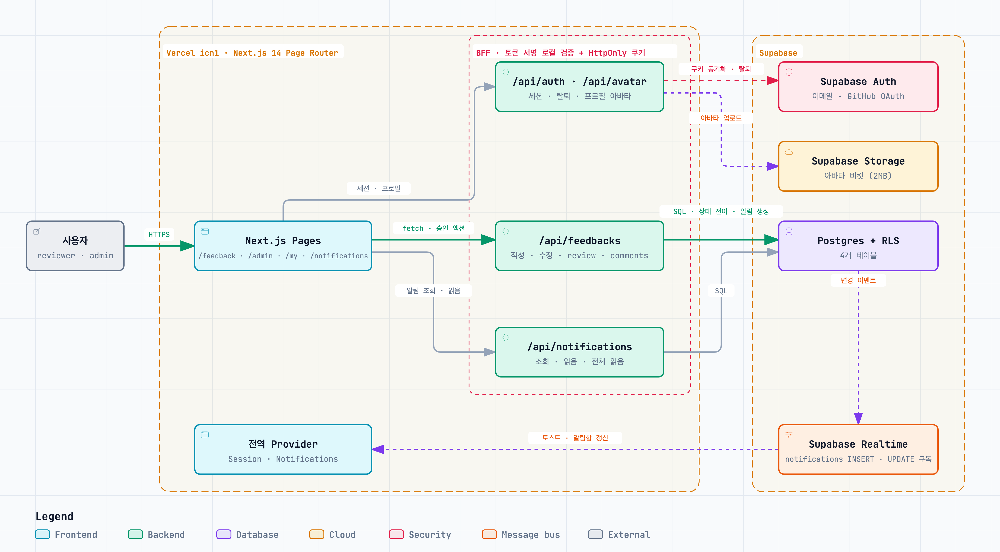
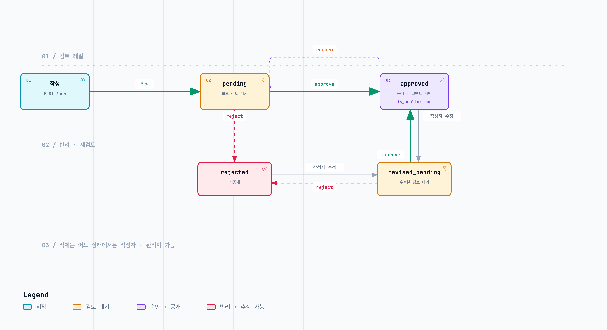
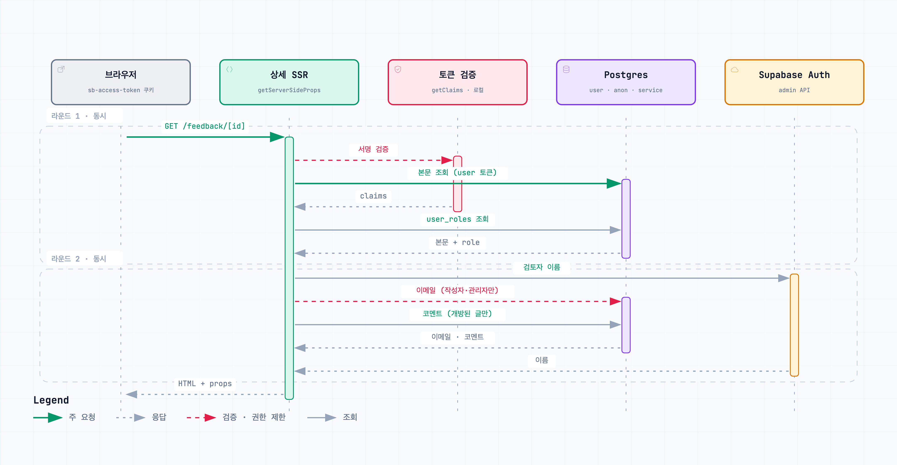
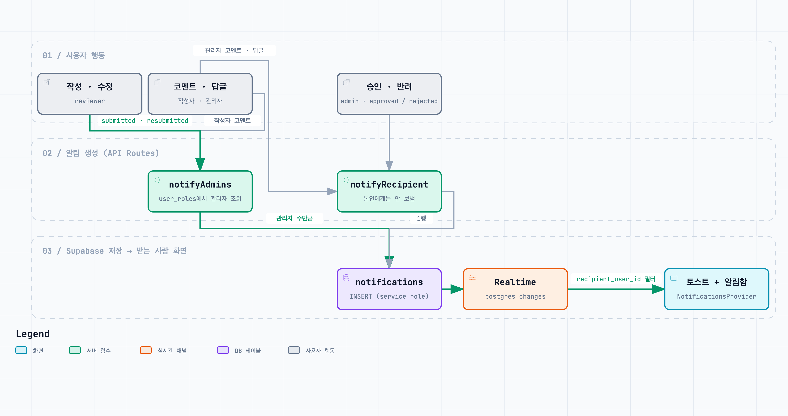

# 인터뷰어 피드백 보드 (Next.js Page Router + Supabase)

> 권한 기반 승인 워크플로우, 코멘트 상호작용, 실시간 알림 흐름을 구현한 포트폴리오 프로젝트

[](https://nextjs.org/)
[](https://www.typescriptlang.org/)
[](https://supabase.com/)
[](https://vercel.com/)

> 코드 구조, API 설계, UX 개선 포인트에 대한 피드백을 편하게 남겨주시면 감사하겠습니다.

---

## 1) 프로젝트 소개

이 프로젝트는 인터뷰어가 피드백을 작성하고, 관리자가 검토 후 공개하는 **권한 기반 피드백 보드**입니다.

공개 목록과 사용자별 비공개 데이터를 분리하고, 작성 → 검토 → 공개로 이어지는 상태 전이를 API에서 강제하는 흐름을 구현했습니다. 여기에 더해, 공개 이후에는 작성자와 관리자가 실제로 대화를 이어갈 수 있는 **코멘트 / 답글 기능**과 승인·코멘트 이벤트를 놓치지 않도록 돕는 **알림함 / 토스트 알림**을 추가해 서비스 흐름을 보강했습니다.

- **핵심 목표**
  - 단순 CRUD를 넘어서, 실제 서비스와 유사한 **승인 프로세스**를 구현
  - 사용자/관리자 역할에 따른 **데이터 가시성 분리**
  - 최초 승인 이후 열리는 **코멘트 스레드와 관리자 응답 구조** 설계
  - 피드백 작성, 검토, 코멘트 응답이 자연스럽게 이어지는 **알림 UX** 구성
  - `getStaticProps` + 온디맨드 재검증 + API Routes + Supabase를 조합한 **실무형 풀스택 구조** 구성

---

## 2) 데모

- Live: [https://next-js-page-router-fetch-api.vercel.app/](https://next-js-page-router-fetch-api.vercel.app/)
- Test Account:
  - Reviewer: `reviewer@gmail.com` / `Reviewer1!`
  - Admin: `admin@gmail.com` / `adminadmin1!`

---

## 3) 주요 기능

### 공통

- 피드백 목록 조회 / 상세 조회
- 최신순 / 오래된순 정렬
- 프로필 / 아바타 반영
- 목록 카드에 코멘트 수 표시
- 수정 중인 승인 피드백은 공개 목록에서 `revised_pending` 프리뷰 카드로 안내
- 알림함에서 읽지 않은 알림 확인 및 읽음 처리

### Auth / Profile

- 이메일/비밀번호 로그인, 회원가입, 비밀번호 재설정
- GitHub OAuth 로그인
- 클라이언트 세션과 서버 HttpOnly 쿠키 동기화
- 내 정보 페이지에서 프로필과 공개 설정 관리
- 프로필 아바타 업로드 (JPG/PNG, 최대 2MB)
- 회원 탈퇴

### Reviewer

- 피드백 작성
- 본인 피드백 수정
- 본인 글의 승인 여부 및 승인 대기 상태 확인
- 최초 승인 이후 본인 피드백 상세에서 코멘트 / 답글 작성
- 승인 / 반려 / 코멘트 / 답글 알림 확인

### Admin

- 관리자 전용 전체 피드백 목록 조회 및 승인 대기 필터링
- 작성자 이메일 포함 전체 데이터 확인
- 승인(`approve`), 반려(`reject`), 재검토(`reopen`)
- 승인 대기 건수 확인
- 피드백 상세에서 코멘트 스레드 열람 및 관리
- 신규 피드백 / 재승인 요청 / 작성자 코멘트 알림 확인

### Comment / Interaction

- 최초 승인 이후 코멘트 스레드 개방
- 승인된 공개 글에서는 누구나 코멘트 열람 가능
- 작성자와 관리자만 코멘트 / 1단계 답글 작성 가능
- 본인 코멘트 수정, 본인 또는 관리자 삭제
- `reopen` 이후에도 기존 코멘트는 유지되며 작성자 / 관리자만 열람 가능
- 알림 링크로 피드백 상세의 특정 코멘트 / 답글 위치로 이동

### Notification

- 피드백 작성 / 재승인 요청 시 관리자에게 알림 생성
- 승인 / 반려 시 작성자에게 알림 생성
- 코멘트 / 답글 작성 시 상대 역할 또는 부모 코멘트 작성자에게 알림 생성
- Supabase Realtime 기반 토스트 알림과 헤더 알림함 연동
- 알림 읽음 처리 및 전체 읽음 처리

---

## 4) 권한 및 상태 전이

### Role 정책

- `reviewer`: 본인 데이터 중심 기능
- `admin`: 검토 큐 접근 및 상태 변경 권한

### Feedback 상태

- `pending` → 최초 작성 후 검토 대기
- `revised_pending` → 수정본 검토 대기
- `approved` → 공개 가능 상태 (`is_public=true`)
- `rejected` → 반려 상태

### 상태 전이 예시

전체 전이는 [6-2. 피드백 상태 전이](#6-2-피드백-상태-전이) 그림을 참고해주세요.

- 작성: `pending`
- 관리자 승인: `pending | revised_pending → approved`
- 관리자 반려: `pending | revised_pending → rejected`
- 관리자 재검토: `approved | rejected → 이전 검토 큐 상태(pending 또는 revised_pending)로 복귀`

### Comment 정책

- 최초 승인 시 `comments_unlocked_at`이 열리며 코멘트 스레드 활성화
- 승인된 공개 글에서는 누구나 열람 가능
- 현재 `approved` + `is_public=true` 상태에서만 작성자와 관리자가 새 코멘트를 작성 가능
- 답글은 1단계까지만 허용
- 비공개 상태로 돌아가도 기존 코멘트는 유지되며 작성자 / 관리자만 계속 열람 가능

### Notification 정책

생성과 전달 경로는 [6-4. 알림 생성과 전달](#6-4-알림-생성과-전달) 그림을 참고해주세요.

- 알림은 수신자 본인만 조회 및 읽음 처리 가능
- 일반 사용자는 알림을 직접 생성하거나 삭제할 수 없고, 서버 API에서 필요한 이벤트에 맞춰 생성
- 피드백이 삭제되면 해당 피드백에 연결된 알림도 함께 삭제
- 코멘트만 삭제된 경우에는 알림은 유지하되 원본 코멘트 참조만 비움

---

## 5) 기술 스택

- **Frontend**: Next.js 14 (Page Router), React 18, TypeScript
- **UI**: Tailwind CSS, shadcn/ui, Radix UI, Sonner, lucide-react
- **Backend(BFF)**: Next.js API Routes
- **Auth/DB/Storage/Realtime**: Supabase
- **Deploy**: Vercel

---

## 6) 아키텍처

> 아래 그림을 클릭하면 인터랙티브 HTML로 열립니다. 노드 검색, 경로 추적(PATH), 챕터별 안내(Play story)를 지원하고, 노드의 `SRC` 배지를 누르면 해당 커밋의 소스 코드로 이동합니다.

### 6-1. 전체 구조

[](https://next-js-page-router-fetch-api.vercel.app/architecture/01-overview.html)

- 브라우저 → Next.js Pages → API Routes → Supabase로 이어지는 주 경로 하나를 중심으로 구성했습니다.
- API Routes(BFF)는 access token 서명을 로컬에서 검증하고 HttpOnly 쿠키와 동기화합니다. Supabase Auth 서버 왕복은 탈퇴·삭제처럼 되돌릴 수 없는 작업에만 남겼습니다.
- 피드백·코멘트 API가 `notifications` 행을 만들면 Supabase Realtime이 받는 사람의 `NotificationsProvider`로 전달합니다.

```text
[Client (Next.js Pages)]
    ├─ / (프로젝트 소개 및 주요 진입점)
    ├─ SessionProvider (세션/권한 동기화)
    ├─ NotificationsProvider (알림 초기 조회 + Realtime 구독)
    ├─ /feedback (공개 데이터 SSG + 수정 중 프리뷰 + 사용자/관리자 데이터 병합 렌더링)
    ├─ /feedback/[id] (상세 SSR + 코멘트 스레드)
    ├─ /feedback/new, /feedback/edit/[id] (피드백 작성 / 수정)
    ├─ /login/* (로그인, 회원가입, 비밀번호 재설정, GitHub OAuth 콜백)
    ├─ /notifications (알림함)
    ├─ /my, /my/withdraw (프로필 관리 / 회원 탈퇴)
    └─ /admin/feedback (관리자 전체 목록 + 검토 UI)

[API Routes]
    ├─ /api/auth/*
    ├─ /api/user-roles
    ├─ /api/feedbacks/*
    ├─ /api/feedbacks/:id/comments*
    ├─ /api/notifications/*
    ├─ /api/avatar/*
    └─ /api/revalidate-list

[Supabase]
    ├─ Auth (auth.users, 이메일 / GitHub OAuth)
    ├─ Postgres + RLS (user_roles, feedbacks, feedback_comments, notifications)
    ├─ Storage (아바타 버킷)
    └─ Realtime (notifications INSERT / UPDATE 구독)
```

### 6-2. 피드백 상태 전이

[](https://next-js-page-router-fetch-api.vercel.app/architecture/02-feedback-status.html)

- `approve` / `reject`는 `pending`, `revised_pending`에서만 허용하고, `reopen`은 `approved` / `rejected`를 직전 검토 큐 상태로 되돌립니다.
- 작성자가 수정하면 `pending`은 그대로 유지되고, 그 외 상태는 `revised_pending`으로 전환되며 `is_public=false`가 됩니다.
- 상태 변경은 현재 `status`를 조건으로 건 update라서, 두 관리자가 동시에 처리하면 한쪽은 409를 받습니다.

### 6-3. 상세 페이지 SSR 요청 흐름

[](https://next-js-page-router-fetch-api.vercel.app/architecture/03-detail-ssr.html)

- 인증(+권한)과 본문 조회를 같은 라운드에 보내고, 검토자 이름·작성자 이메일·코멘트 조회를 두 번째 라운드에 묶어 순차 6회 왕복을 2라운드로 줄였습니다.
- 토큰 서명은 `getClaims`로 로컬 검증하며 JWKS는 10분 캐시됩니다. 첫 검증 53ms, 이후 1ms 수준입니다.
- 만료·폐기된 토큰이면 본문 조회가 실패하므로 익명 권한으로 한 번만 재조회해, 공개 글이 404로 가려지지 않게 했습니다.
- 로컬 측정(9회 중앙값) 기준 상세 페이지 응답이 274ms에서 121ms로 줄었습니다.

### 6-4. 알림 생성과 전달

[](https://next-js-page-router-fetch-api.vercel.app/architecture/04-notifications.html)

- 작성·재승인 요청·작성자 코멘트는 관리자 전원에게, 승인·반려는 작성자에게, 답글은 부모 코멘트 작성자에게 갑니다.
- 알림 행은 서버 API만 만들고, 행동한 본인에게는 만들지 않습니다. 알림 생성이 실패해도 원래 요청은 성공으로 응답하고 로그만 남깁니다.
- 브라우저는 자기 `recipient_user_id` 행만 Realtime으로 구독해 토스트와 헤더 알림함을 갱신합니다.

---

## 7) 폴더 구조

```text
src/
  pages/                    # Page Router 페이지 + API Routes
    api/                    # auth, avatar, feedbacks, notifications, user-roles, revalidate-list
    feedback/               # 목록(SSG), 상세(SSR), 작성, 수정
    admin/feedback/         # 관리자 검토 목록
    login/                  # 로그인, 회원가입, 비밀번호 재설정, OAuth 콜백
    my/, notifications/     # 프로필·탈퇴, 알림함
  components/
    session/                # SessionProvider, 세션·쿠키 동기화 훅
    notifications/          # NotificationsProvider, Realtime 구독, 알림 벨
    feedback/               # 목록 카드, 작성 폼, 상세·코멘트 스레드
    admin/, my/, common/    # 관리자 검토 UI, 프로필 편집, 공용 버튼
    layout/, ui/            # 전역 레이아웃, Alert·Confirm·Dialog, 로딩·실패·빈 상태, shadcn 컴포넌트
  hooks/                    # 페이지 단위 데이터·폼 컨트롤러 훅
  lib/
    auth/                   # 토큰 로컬 검증, API 요청 인증, 회원가입 흐름
    feedback/               # 피드백·코멘트 서버 조회, 목록 병합, 표시 유틸
    notification/           # 알림 생성·조회, 문구, 매퍼
    supabase/               # anon / user / service role 클라이언트
    api/, avatar/, forms/, user/, user-role/, navigation/, shared/, status/
  constants/                # 컬럼 목록, 문구, 검증 규칙
  types/                    # 도메인·API 응답 타입
  scripts/                  # 시드, 아바타 스토리지 리셋
  styles/                   # Tailwind 진입점
  mock/                     # 로컬 목업 데이터
tests/
  unit/, api/, e2e/         # Playwright 기반 단위·API·E2E 테스트
docs/architecture/          # README용 다이어그램 PNG
public/architecture/        # 인터랙티브 다이어그램 HTML (배포 후 /architecture/*.html)
```

---

## 8) 데이터 모델 / RLS 요약

### 주요 테이블

- `auth.users` → Supabase 인증 사용자
- `user_roles` → 사용자 role (`reviewer`, `admin`)
- `feedbacks` → 피드백 본문, 상태, 공개 여부, 승인 이력
- `feedback_comments` → 코멘트 / 1단계 답글
- `notifications` → 피드백 / 코멘트 이벤트 기반 알림

### 주요 컬럼

- `feedbacks.status` → 현재 검토 상태
- `feedbacks.review_queue_status` → 재검토 큐 문맥
- `feedbacks.comments_unlocked_at` → 최초 승인 이후 코멘트 스레드 개방 여부
- `feedback_comments.parent_comment_id` → 1단계 답글 구조
- `notifications.type` → 알림 종류
- `notifications.is_read`, `notifications.read_at` → 알림 읽음 상태
- `notifications.feedback_id`, `notifications.comment_id` → 알림이 가리키는 피드백 / 코멘트 참조

### RLS 방향

- 공개 승인된 피드백은 익명 포함 조회 가능
- 비공개 / 미승인 피드백은 작성자와 관리자만 조회 가능
- 코멘트는 승인 이력이 있는 피드백에서만 읽을 수 있으며, 비공개 상태에서는 작성자와 관리자만 조회 가능
- 새 코멘트 작성은 현재 승인된 공개 상태에서만 허용
- 알림은 수신자 본인만 조회하고 읽음 처리 가능

---

## 9) API 엔드포인트 요약

### Feedbacks

| Method | Endpoint                                             | 설명                                                       | 권한              |
| ------ | ---------------------------------------------------- | ---------------------------------------------------------- | ----------------- |
| GET    | `/api/feedbacks?status=approved`                     | 공개 피드백 목록 조회                                      | 공개              |
| GET    | `/api/feedbacks?status=pending,revised_pending`      | 관리자 검토 큐 조회                                        | admin             |
| GET    | `/api/feedbacks?status=rejected`                     | 반려 목록 조회                                             | admin             |
| GET    | `/api/feedbacks/mine?status=pending,revised_pending` | 내 검토 대기/수정 대기 피드백 조회 (`admin`은 `null` 반환) | 로그인            |
| POST   | `/api/feedbacks/new`                                 | 피드백 생성                                                | 로그인            |
| PATCH  | `/api/feedbacks/:id`                                 | 피드백 수정 후 재검토 대기 전환                            | 작성자            |
| DELETE | `/api/feedbacks/:id/delete`                          | 피드백 삭제                                                | 작성자 또는 admin |
| PATCH  | `/api/feedbacks/:id/review`                          | 승인(`approve`)/반려(`reject`)/재검토(`reopen`)            | admin             |
| GET    | `/api/feedbacks/pending-count`                       | 승인 대기 건수 조회                                        | admin             |

### Comments

| Method | Endpoint                                 | 설명                              | 권한                     |
| ------ | ---------------------------------------- | --------------------------------- | ------------------------ |
| GET    | `/api/feedbacks/:id/comments`            | 코멘트 / 답글 목록 조회           | 공개 또는 작성자 / admin |
| POST   | `/api/feedbacks/:id/comments`            | 코멘트 또는 1단계 답글 작성       | 작성자 또는 admin        |
| PATCH  | `/api/feedbacks/:id/comments/:commentId` | 본인 코멘트 수정                  | 본인 작성자              |
| DELETE | `/api/feedbacks/:id/comments/:commentId` | 본인 코멘트 삭제 또는 관리자 삭제 | 본인 작성자 또는 admin   |

### Notifications

| Method | Endpoint                      | 설명                   | 권한   |
| ------ | ----------------------------- | ---------------------- | ------ |
| GET    | `/api/notifications`          | 내 알림 목록 조회      | 로그인 |
| PATCH  | `/api/notifications/read`     | 선택한 알림 읽음 처리  | 로그인 |
| PATCH  | `/api/notifications/read-all` | 내 알림 전체 읽음 처리 | 로그인 |
| PATCH  | `/api/notifications/:notiId`  | 단일 알림 읽음 처리    | 로그인 |

### Auth / User / Avatar

| Method | Endpoint              | 설명                                           | 권한   |
| ------ | --------------------- | ---------------------------------------------- | ------ |
| POST   | `/api/auth/session`   | access token 검증 후 HttpOnly 세션 쿠키 동기화 | 로그인 |
| DELETE | `/api/auth/session`   | 세션 쿠키 삭제                                 | 공개   |
| DELETE | `/api/auth/withdraw`  | 회원 탈퇴 및 저장된 아바타 정리                | 로그인 |
| POST   | `/api/user-roles`     | 사용자 role 생성/동기화 (`reviewer` 기본값)    | 로그인 |
| POST   | `/api/avatar/upload`  | 프로필 아바타 업로드                           | 로그인 |
| GET    | `/api/avatar/:userId` | 아바타 프록시 조회 (없으면 placeholder 반환)   | 공개   |

### Infra

| Method | Endpoint               | 설명                        | 권한                          |
| ------ | ---------------------- | --------------------------- | ----------------------------- |
| POST   | `/api/revalidate-list` | `/feedback` ISR 캐시 무효화 | secret header 또는 query 필요 |

- 보호 API는 `Authorization: Bearer <accessToken>` 기반으로 동작합니다.
- `GET /api/feedbacks`의 기본 조회 상태는 `approved`입니다.
- `GET /api/feedbacks/mine`의 기본 조회 상태는 `pending,revised_pending`입니다.
- `admin`이 `GET /api/feedbacks/mine`을 호출하면 목록 대신 `data: null`을 반환합니다.
- 코멘트는 첫 승인 이후부터 활성화되며, 새 작성은 현재 승인된 공개 상태에서만 가능합니다.
- 알림은 피드백 작성, 승인/반려, 코멘트/답글 작성 흐름에서 서버 API가 생성합니다.
- `POST /api/revalidate-list`는 `x-revalidate-secret` 헤더 또는 `?secret=` 쿼리가 필요합니다.

---

## 10) 로컬 실행 방법

```bash
npm ci
npm run dev
```

### 주요 스크립트

```bash
npm run dev
npm run lint
npm run build
npm run test
npm run test:unit
npm run test:api
npm run test:e2e
npm run seed:feedback
npm run seed:notifications
npm run reset:avatars
```

### 필수 환경 변수

```bash
SUPABASE_URL=
SUPABASE_ANON_KEY=
NEXT_PUBLIC_SUPABASE_URL=
NEXT_PUBLIC_SUPABASE_ANON_KEY=
SUPABASE_SERVICE_ROLE_KEY=
SUPABASE_AVATAR_BUCKET=
REVALIDATE_SECRET=
```

- 브라우저 클라이언트는 `NEXT_PUBLIC_SUPABASE_URL`, `NEXT_PUBLIC_SUPABASE_ANON_KEY`를 사용합니다.
- 서버 anon 조회는 `SUPABASE_URL` / `SUPABASE_ANON_KEY` 또는 public env fallback을 사용합니다.
- 관리자 작업과 일부 시스템성 API는 `SUPABASE_SERVICE_ROLE_KEY`가 필요합니다.
- 아바타 업로드/삭제는 `SUPABASE_AVATAR_BUCKET`이 필요합니다.

---

## 11) 회고

- 권한 모델과 상태 전이를 API 단에서 강제하고, UI는 해당 정책을 반영하는 구조로 설계했습니다.
- `/feedback`는 공개 데이터와 권한 데이터를 분리 수집한 뒤 하나의 리스트로 병합해, 사용자 역할에 따라 다른 보드를 보여주도록 구성했습니다.
- 코멘트 기능을 추가하면서 공개/비공개 전환이 있는 서비스에서의 상호작용 정책, RLS, 승인 이력(`comments_unlocked_at`) 설계를 함께 다뤘습니다.
- 알림 기능을 추가하면서 단순히 데이터를 저장하는 것보다 “사용자가 다음 행동을 놓치지 않도록 연결하는 흐름”이 중요하다는 점을 함께 고려했습니다.
- 단순한 CRUD를 넘어 인증/인가, 데이터 가시성, 동시성 경합, 관리자 응답 흐름 같은 실서비스 이슈를 직접 구현해본 프로젝트입니다.

---

## 12) 추후 계획

- React Suspense를 학습한 뒤 `/feedback` 목록 페이지에 역할별 비동기 경계를 적용해보고 싶습니다. 전체 공개 게시물, 작성자가 확인할 수 있는 승인 대기 게시물, 관리자가 확인할 수 있는 검토용 전체 게시물을 분리 로딩해 사용자에게 필요한 데이터를 더 자연스럽게 보여주는 방향으로 UX를 개선할 계획입니다.
- Suspense뿐 아니라 Recoil, React Query(TanStack Query) 같은 상태 관리 / 서버 상태 라이브러리도 함께 스터디 중입니다. 현재 권한 모델과 승인 워크플로우에 어떤 방식이 더 적합한지 비교해본 뒤, 데이터 패칭 구조 개선에 반영해보려 합니다.
- 장기적으로는 이메일 알림, 관리자 응답 히스토리, 알림 보관 정책처럼 서비스 운영 관점의 기능도 확장해보고 싶습니다.

---

## 13) 기술 블로그

1. [인터뷰어 피드백 보드 프로젝트를 시작한 이유](https://velog.io/@ckstlr0828/Next.js-Supabase-프로젝트-인터뷰어-피드백-보드-프로젝트를-시작한-이유)
2. [아키텍처와 인증/인가 흐름](https://velog.io/@ckstlr0828/Next.js-Supabase-프로젝트-아키텍처와-인증인가-흐름)
3. [피드백 상태 전이와 관리자 검토 워크플로우 구현](https://velog.io/@ckstlr0828/Next.js-Supabase-프로젝트-피드백-상태-전이와-관리자-검토-워크플로우-구현)
4. [service_role과 anon key, 정말 적재적소에 쓰고 있을까?](https://velog.io/@ckstlr0828/Next.js-Supabase-servicerole과-anon-key-정말-적재적소에-쓰고-있을까)
5. [승인 이력 기반 코멘트 기능 설계하기](https://velog.io/@ckstlr0828/Next.js-Supabase-%ED%94%84%EB%A1%9C%EC%A0%9D%ED%8A%B8-%EC%8A%B9%EC%9D%B8-%EC%9D%B4%EB%A0%A5-%EA%B8%B0%EB%B0%98-%EC%BD%94%EB%A9%98%ED%8A%B8-%EA%B8%B0%EB%8A%A5-%EC%84%A4%EA%B3%84%ED%95%98%EA%B8%B0)
6. [상태 변화와 코멘트 흐름을 놓치지 않게 알림 기능 설계하기](https://velog.io/@ckstlr0828/Next.js-Supabase-%ED%94%84%EB%A1%9C%EC%A0%9D%ED%8A%B8-%EC%83%81%ED%83%9C-%EB%B3%80%ED%99%94%EC%99%80-%EC%BD%94%EB%A9%98%ED%8A%B8-%ED%9D%90%EB%A6%84%EC%9D%84-%EB%86%93%EC%B9%98%EC%A7%80-%EC%95%8A%EA%B2%8C-%EC%95%8C%EB%A6%BC-%EA%B8%B0%EB%8A%A5-%EC%84%A4%EA%B3%84%ED%95%98%EA%B8%B0)
7. [리펙토링 - usehooks-ts, zod, @hookform/resolvers 라이브러리 도입](https://velog.io/@ckstlr0828/Next.js-Supabase-%ED%94%84%EB%A1%9C%EC%A0%9D%ED%8A%B8-%EB%A6%AC%ED%8E%99%ED%86%A0%EB%A7%81-usehooks-ts-zod-hookformresolvers-%EB%9D%BC%EC%9D%B4%EB%B8%8C%EB%9F%AC%EB%A6%AC-%EB%8F%84%EC%9E%85)

---

## 14) 작성자

- 이름: 최찬식
- GitHub: [https://github.com/CHANSIK-CHOI](https://github.com/CHANSIK-CHOI)
- Velog: [https://velog.io/@ckstlr0828/posts](https://velog.io/@ckstlr0828/posts)
- Email: [ccsik0828@gmail.com](mailto:ccsik0828@gmail.com)
